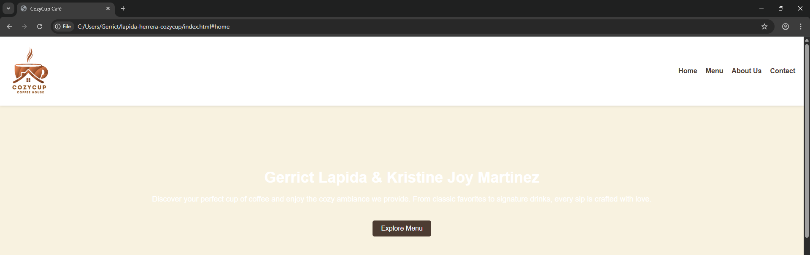
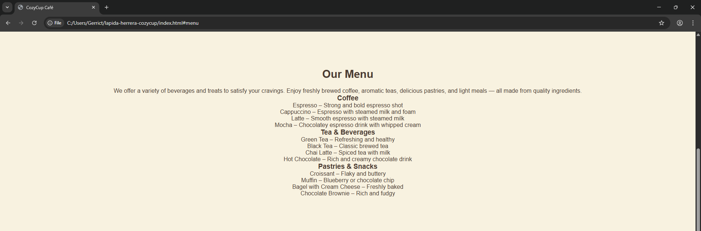
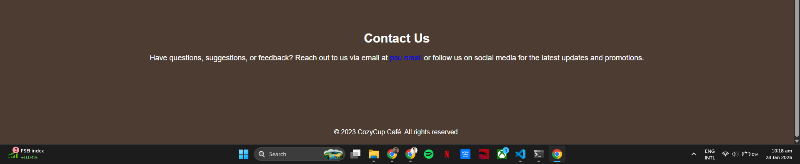

# Cozy Cup Cafe

## Project Description
Cozy Cup Cafe is a simple web-based system that showcases a cafe's menu, promotions, and ordering options. It provides an interactive and user-friendly experience for customers.

---

## Features
- View cafe menu with item descriptions
- Place orders online
- See ongoing promotions and deals
- Contact information for the cafe
- Responsive design for desktop and mobile

---

## Screen Captures
### Home Page
  
The main page showing cafe name, featured items, and navigation menu.

### Menu Page
  
Displays all cafe items with images, descriptions, and prices.

### Promotions Page
  
Shows current deals, discounts, and special offers.

### Contact Page
  
Provides cafe contact info and a contact form for inquiries.

---

## About the Authors

### Author 1

**Name:** Gerrict Lapida  
**Email:** 202040036@psu.palawan.edu.ph 

Connect with me:  
  

### Author 2
  

**Name:** Shan Janssen Carl E. Herrera  
**Email:** 202380407@psu.palawan.edu.ph  

Connect with me:  
  
